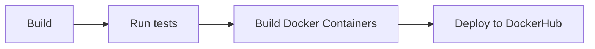

# Backend (Practice Module)


This Documentation is still WIP.

## Getting Started
1. Install Gradle plugin for your IDE.

## Commands
`./gradlew clean` : remove the build files generated from the build command  
`./gradlew build` : build the project  
`./gradlew bootrun` : run the project  
`./gradlew test` : run the tests 


## File Structure

```
🗂️── .github/workflows     
|  └──🗂️ build.yml                          GitHub CI pipeline workflow  
🗂️── build                                  Compiled files
🗂️── src                                    Source files
|  ├──🗂️ main               
|  |  └──🗂️ java               
|  |    └──🗂️ nus.iss.team3.backend
|  |      ├──🗂️ controller                  Contains the Rest API that would serve inputs from the frontend      
|  |      ├──🗂️ dataaccess                  Contains the DAOs, handles the details required to connect to databases
|  |      ├──🗂️ entity                      Contains the Entity Object. Each entity represents a database table, logical grouping of multiple tables or entity required for communicating between different modules of the system 
|  |      ├──🗂️ service                     Contains the logic to handle the interaction between different entities in the system
|  |      ├──🗂️ util                        Contains Utils functions that support the main system
|  |      └── BackendApplication.java              
├── README.md
|── build.gradle                            Dependencies and plugins of project       
└── ...
```

## Continuous Integration

The project is using [GitHub Actions](https://docs.github.com/en/actions) for the Continuous Integration (CI) pipeline. 

Refer to `.github/workflows/build.yml` file for the detailed steps in the CI pipeline.

The following diagram illustrates the overview of the CI workflow:



**TODO**: add scanning stages to CI pipeline