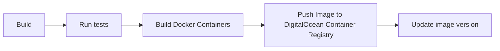
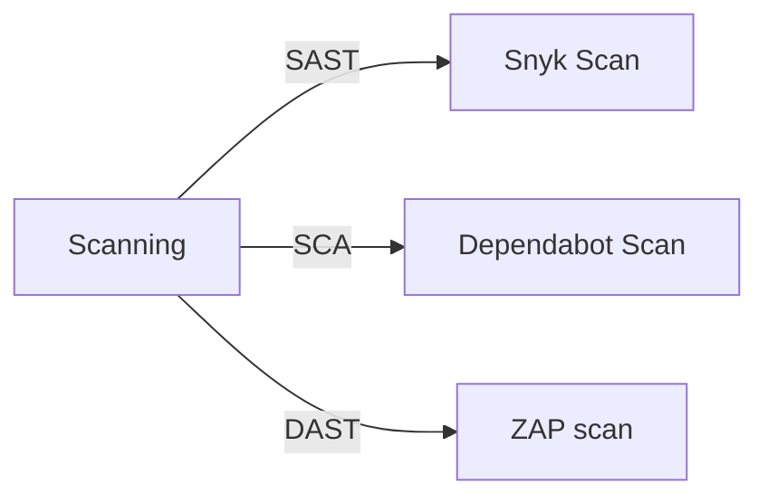

# Backend (Practice Module)

## Getting Started

1. Install Gradle plugin for your IDE
2. Update your `.env` file accordingly for any changes to your local setup
3. Ensure [JDK 22](https://www.oracle.com/java/technologies/javase/jdk22-archive-downloads.html) is installed
4. Clone the [deployment](https://github.com/dmss-group3-practice-module/deployment) repository and execute the `scripts/db-init.sql` and `scripts/db-testdata.sql` scripts to seed the database
5. Login into the team's postman workspace to access existing APIs
6. Run the application with `./gradlew clean spotlessapply build bootrun`

## Commands

#### Gradle

`./gradlew clean` : remove the build files generated from the build command  
`./gradlew spotlessapply` : format your codebase according to google java format  
`./gradlew build` : build the project  
`./gradlew bootrun` : run the project  
`./gradlew test` : run the tests  
`./gradlew clean spotlessapply build bootrun` : clean, do spotlessapply, build and run together

#### Docker

`docker build -t feats-backend .`: build a docker container named *feats-backend* with the *latest* tag  
`docker run -d -p 8089:8089 feats-backend`: run the docker container on port 8089

## Spring Profile

Spring profiles are used to identify different settings for different environment.
to apply profiles, run `java -jar -Dspring.profiles.active=docker`

#### List of Profiles

- **development**: on default, for running backend in the local machine and connecting to a local database
- **development**: for connecting to the docker image created with the deployment project

## File Structure

```
🗂️── .github/workflows     
|  └──🗂️ build.yml                          GitHub CI pipeline for building and pushing image  
|  └──🗂️ dast.yml                           GitHub CI pipeline for DAST scanning with ZAP  
|  └──🗂️ sast.yml                           GitHub CI pipeline for SAST scanning with Snyk  
🗂️── scripts                                Compiled files
|  └──🗂️ zap-script.sh                      script to run ZAP scan for DAST  
🗂️── build                                  Compiled files
🗂️── src                                    Source files
|  ├──🗂️ main               
|  |  └──🗂️ java               
|  |    └──🗂️ nus.iss.team3.backend
|  |      ├──🗂️ businessService             Contains the business logic for the services      
|  |      ├──🗂️ domainService               Contains the domain-driven encapsulated logic for the services      
|  |      ├──🗂️ controller                  Contains the Rest API that would serve inputs from the frontend      
|  |      ├──🗂️ dataaccess                  Contains the DAOs, handles the details required to connect to databases
|  |      ├──🗂️ entity                      Contains the Entity Object. Each entity represents a database table, logical grouping of multiple tables or entity required for communicating between different modules of the system 
|  |      ├──🗂️ service.util                Contains Utils functions that support the main system
|  |      └── BackendApplication.java
|  |  └──🗂️ resources
|  |    └── application.yml                 Contains the properties the application requires
├── README.md
|── build.gradle                            Dependencies and plugins of project     
|── .env                                    hidden file that need re-creation upon each environment       
└── ...
```

## Continuous Integration

The project is using [GitHub Actions](https://docs.github.com/en/actions) for the Continuous Integration (CI) pipeline.

Refer to `.github/workflows/build.yml` file for the detailed steps in the CI pipeline.

The following diagram illustrates the overview of the CI workflow:





## Continuous Deployment

Continuous Deployment is done using [ArgoCD](https://argo-cd.readthedocs.io/en/stable/). The CI pipeline will end with updating the application's image version onto the kubernetes yaml file found in the [deployment repo](https://github.com/dmss-group3-practice-module/deployment). There will be an ArgoCD agent in the kubernetes cluster on hosted on DigitalOcean which listens to version changes in the `deployment` repository. 